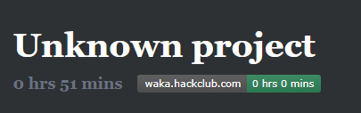

# Mei-Misaki-My-Beloved
Ricing Arch Linux  

Part of the Hackclub Riceathon  
Dedicated to my obsession with Mei Misaki from Another  

# Features
Another: Mei Misaki Background  
Dark Filesystem Theme  
VSCode theme: Doki Theme: Chuunibyo: Rikka (Rikka Takanashi is half of the reason I am obsessed with Misaki)  
Custom CLI prompt coloration  
Custom message on Neofetch ("Do mess with things that don't exist)  

# Time Taken
Time logged: 0:51  
[Bugged out badge because Github is doing ??? to my image links](https://waka.hackclub.com/api/badge/U081686E34P/interval:today/project:-)  
  
  
Note - Yes, my Hackatime is severely bugged out because of who knows why and as of writing is displaying 0:00 on the sticker  

Actual: About a week given time to install, do research, and implement everything  

# Gallery

[Take a look here](/gallery/)  
